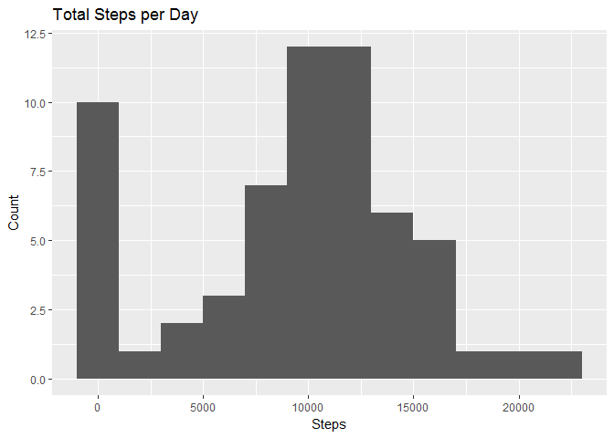

# Reproducible Research: Peer Assessment 1


## Loading and preprocessing the data  


```r
#download, unzip and read file the zipfile
if(!file.exists("activity.zip")){
        download.file("https://d396qusza40orc.cloudfront.net/repdata%2Fdata%2Factivity.zip", "activity.zip")
        unzip("activity.zip")
}

#read file
activity <- read.csv("activity.csv")

# convert date column to data format
activity$date <- as.Date(as.character(activity[["date"]]), "%Y-%m-%d")
```

## What is mean total number of steps taken per day?

```r
library(ggplot2)
library(dplyr)
```

```
## 
## Attaching package: 'dplyr'
```

```
## The following objects are masked from 'package:stats':
## 
##     filter, lag
```

```
## The following objects are masked from 'package:base':
## 
##     intersect, setdiff, setequal, union
```

```r
#get total steps in each day
totalStepsPerDay <- activity %>% group_by(date) %>% summarize(total.steps = sum(steps, na.rm = TRUE))

#plot histogram of total steps per day
g <- ggplot(totalStepsPerDay, aes(total.steps))
g + geom_histogram(binwidth = 2000) + labs(title = "Total Steps per Day") + labs(x = "Steps", y = "Count")
```

<!-- -->

```r
# calculating mean and median for total steps per day
mean(totalStepsPerDay$total.steps, na.rm = TRUE)
```

```
## [1] 9354.23
```

```r
median(totalStepsPerDay$total.steps, na.rm = TRUE)
```

```
## [1] 10395
```

## What is the average daily activity pattern?

```r
# calculate the avg # of steps taken in each 5 min interval across all days
avgStepsIntv <- activity %>% group_by(interval) %>% summarize(mean.interval.steps = mean(steps, na.rm = TRUE))

# time series plot of avg # of steps taken in each time interval
g <- ggplot(avgStepsIntv, aes(interval, mean.interval.steps))
g + geom_line() + labs(title = "Avg Steps in each interval") + labs(x = "Interval", y = "Average Steps (mean across all days)")
```

<!-- -->

```r
#5 minute window that has the maximum steps
maxStepsItvl <- max(avgStepsIntv$mean.interval.steps, na.rm = TRUE)
avgStepsIntv[avgStepsIntv$mean.interval.steps == maxStepsItvl,c("interval")]
```

```
## # A tibble: 1 × 1
##   interval
##      <int>
## 1      835
```

## Imputing missing values


```r
# calculate total number of missing values in the dataset 
sum(is.na(activity$steps))
```

```
## [1] 2304
```

```r
#filling in all of the missing values with mean for that 5-minute interval

activity$steps.imputed <- apply(activity, 1, function(x) {
      
        if (is.na(x[["steps"]])) {
                c <- avgStepsIntv[avgStepsIntv$interval == as.numeric(x[["interval"]]), c("mean.interval.steps")]
                as.numeric(c)
        } else{
                as.numeric(x[["steps"]])
        }
        
})

# calculate total number of missing values in the dataset after imputing 
sum(is.na(activity$steps.imputed))
```

```
## [1] 0
```

```r
#get total (imputed) steps in each day 
totalStepsPerDayImputed <- activity %>% group_by(date) %>% summarize(total.steps.imputed = sum(steps.imputed, na.rm = TRUE))

#plot histogram of total steps per day
g <- ggplot(totalStepsPerDayImputed, aes(total.steps.imputed))
g + geom_histogram(binwidth = 2000) + labs(title = "Total Steps per Day") + labs(x = "Steps", y = "Count")
```

<!-- -->

```r
# calculating mean and median for total steps per day (imputed)
mean(totalStepsPerDayImputed$total.steps.imputed, na.rm = TRUE)
```

```
## [1] 10766.19
```

```r
median(totalStepsPerDayImputed$total.steps.imputed, na.rm = TRUE)
```

```
## [1] 10766.19
```

```r
# calculating mean and median for total steps per day
mean(totalStepsPerDay$total.steps, na.rm = TRUE)
```

```
## [1] 9354.23
```

```r
median(totalStepsPerDay$total.steps, na.rm = TRUE)
```

```
## [1] 10395
```

## Are there differences in activity patterns between weekdays and weekends?

```r
#creating a factor variable for weekdays and weekends
activity$weekday <- weekdays(activity$date)
activity$weekdayend <- as.factor(ifelse(activity$weekday %in% c("Saturday","Sunday"),"weekend", "weekday"))

# calculate the avg # of steps taken in each 5 min interval on weekdays vs. weekends
avgStepsIntvWeekDayEnd <- activity %>% group_by(interval, weekdayend) %>% summarize(mean.interval.steps = mean(steps.imputed, na.rm = TRUE))

# time series plot of avg # of steps taken in each time interval on weekdatys vs. weekends
g <- ggplot(avgStepsIntvWeekDayEnd, aes(interval, mean.interval.steps))
g + geom_line() + labs(title = "Avg Steps in each interval") + labs(x = "Interval", y = "Average Steps (mean across all days)") + facet_wrap(~weekdayend, ncol = 1)
```

<!-- -->
